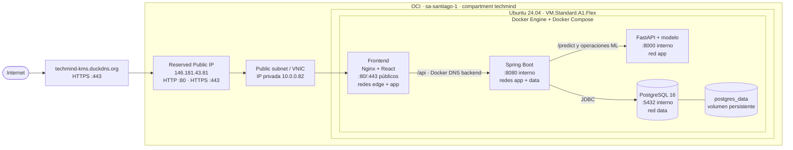

# Arquitectura e integración de TechMind

> Estado vigente al 25 de agosto de 2026: MVP integrado, desplegado y validado
> en OCI. Este documento describe la materialización actual, no una topología
> futura de producción.

## Objetivo

TechMind organiza conocimiento técnico mediante una interfaz React, una API de
negocio Spring Boot, un servicio de inferencia FastAPI y persistencia en
PostgreSQL. El sistema desplegado conserva un único punto de entrada web y
mantiene los servicios de aplicación y datos fuera de Internet.

## Topología desplegada



No existen Load Balancer, Kubernetes ni una aplicación Terraform aplicada en
esta topología.

## Infraestructura OCI actual

| Elemento | Estado desplegado |
|---|---|
| Región | Chile Central (Santiago), `sa-santiago-1` |
| Compartment | `techmind` |
| Instancia | `instance-20260822-1253` |
| Shape | `VM.Standard.A1.Flex` |
| CPU y memoria | ARM64/Ampere, 1 OCPU, 6 GB RAM |
| Sistema operativo | Ubuntu 24.04 |
| IP privada | `10.0.0.82` |
| IP pública | Reservada, `146.181.43.81` |
| Dominio | `techmind-kms.duckdns.org` |
| Runtime | Docker Engine, Docker Compose y Buildx |
| Acceso principal con overlay HTTPS | `https://techmind-kms.duckdns.org` |

## Servicios y responsabilidades

| Servicio | Responsabilidad | Exposición |
|---|---|---|
| Frontend/Nginx | Servir React, TLS y enviar `/api/` a Spring Boot | Host TCP 80/443 con overlay |
| Backend/Spring Boot | API, reglas de negocio, orquestación y persistencia | Solo Docker TCP 8080 |
| Inference/FastAPI | Clasificación, batch y clustering mediante el modelo | Solo Docker TCP 8000 |
| PostgreSQL 16 | Persistencia administrada por Backend | Solo Docker TCP 5432 |

Frontend no consume FastAPI ni PostgreSQL directamente. Nginx utiliza el DNS
interno `backend`; Spring Boot utiliza `inference` y `postgres`.

### Enriquecimiento conservador de dominio

Antes de la inferencia, FastAPI aplica DomainExpander V2: una etapa conservadora
de enriquecimiento semántico de dominio para reforzar terminología técnica poco
representada en el dataset. La lógica utiliza evidencia ponderada, umbrales y
desambiguación antes de añadir, como máximo, una única señal de dominio. No
modifica el modelo entrenado, no contamina las palabras clave extraídas y no
garantiza por sí sola una mejora en todas las predicciones.

## Redes Docker

| Red | Servicios | Propiedad |
|---|---|---|
| `edge` | Frontend | Acceso al puerto publicado |
| `app` | Frontend, Backend, inference | `internal=true` |
| `data` | Backend, PostgreSQL | `internal=true` |

Solo Frontend declara `ports`. Backend, inference y PostgreSQL utilizan
exclusivamente conectividad interna de Compose.

## Persistencia y esquema

- PostgreSQL utiliza el volumen Docker `postgres_data`.
- Flyway administra el esquema mediante las migraciones V1 y V2.
- Hibernate utiliza `ddl-auto=validate`; no crea ni actualiza el esquema.
- La persistencia fue validada después de `docker compose restart`.
- `docker compose down -v` elimina el volumen y no forma parte del procedimiento
  operativo normal.

## Arranque y healthchecks

El orden lógico es:

```text
postgres healthy ─┐
                  ├─→ backend healthy ─→ frontend healthy
inference healthy ┘
```

- PostgreSQL: `pg_isready`.
- Inference: HTTP válido, `status=ok` y `model_loaded=true`.
- Backend: `/api/health` con estado global `UP`.
- Frontend: `/health` servido por Nginx.

## Seguridad materializada

- Puertos públicos autorizados: SSH `22/tcp`, HTTP `80/tcp` y HTTPS `443/tcp`.
- El certificado de `techmind-kms.duckdns.org` es administrado por Certbot en el
  host y se monta en Frontend como solo lectura mediante `compose.https.yaml`.
- HTTP conserva `/health` y el desafío ACME; el resto se redirige a HTTPS cuando
  el overlay está activo.
- UFW y Fail2ban están activos.
- SSH usa clave; el acceso root y por contraseña está deshabilitado.
- La política de forwarding es `DROP`.
- `DOCKER-USER` protege el acceso a metadata de OCI.
- La instancia utiliza IMDSv2.
- No se publican `8080`, `8000` ni `5432`.

Los secretos se mantienen en el `.env` privado de la VM. No se versionan
contraseñas, claves privadas, tokens ni OCIDs sensibles.

## Estado funcional público

Se validaron desde el punto de entrada público:

- health;
- clasificación;
- historial;
- batch JSON;
- feedback;
- búsqueda;
- recomendaciones;
- estadísticas;
- clustering;
- persistencia después de reiniciar los servicios.

## Operación y evolución

El repositorio ejecuta CI separado para Backend, Frontend e inference. El
despliegue actual es manual: OCI no observa GitHub ni despliega cambios de
`main` automáticamente. La actualización vigente consiste en sincronización
controlada, build o recreación de los servicios afectados y smoke test.

El dominio y el soporte HTTPS se materializan mediante un overlay que conserva
intacto el baseline HTTP local. La renovación usa Certbot en el host y webroot
sin detener Frontend. El CD automático permanece pendiente. La guía operativa
está en [`deployment-oci.md`](deployment-oci.md).
