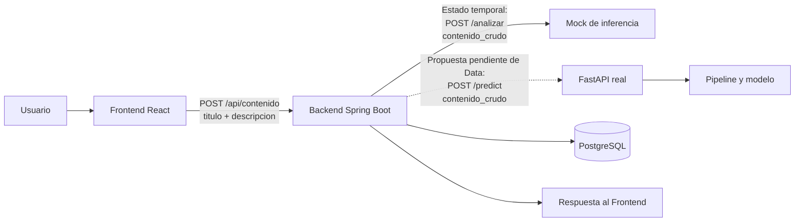

# Arquitectura e integración de TechMind

> Estado: documento de alineación. Registra acuerdos confirmados, el estado
> temporal de la implementación y propuestas que todavía requieren validación.

## Propósito

Este documento formaliza la integración que el equipo viene desarrollando sin
reemplazar la planificación por sprints definida por el Tech Lead. Cuando un
punto aún no ha sido aprobado, se identifica expresamente como propuesta o
recomendación.

## Estado de las decisiones

| Tema | Estado | Definición actual |
|---|---|---|
| Arquitectura general | Confirmado | React → Spring Boot → FastAPI/modelo, con PostgreSQL para la persistencia acordada por Backend y despliegue en OCI. |
| API Frontend → Spring Boot | Confirmado | `POST /api/contenido` recibe `titulo` y `descripcion`. |
| Integración temporal Spring Boot → mock | Temporal | Spring Boot invoca `/analizar` y envía `contenido_crudo`. Permite avanzar a Backend durante el Sprint 1. |
| Integración Spring Boot → FastAPI real | Pendiente de Data | Se propone `POST /predict`, con `contenido_crudo`, y una respuesta con `categoria`, `probabilidad` y `palabras_clave`. |
| Idioma, dataset y taxonomía | Pendiente de Data | Data los definirá antes del meet del lunes y validará o ajustará el contrato propuesto. |
| Topología y controles de OCI | Recomendación DevOps | DevOps puede avanzar con el preflight y una propuesta técnica, pero la topología definitiva aún no está aprobada. |

## Flujo confirmado y transición prevista



El mock no fija el contrato definitivo de FastAPI. Su función es sostener el
avance actual de Backend y será reemplazado cuando Data valide el servicio real.

## Responsabilidades de los componentes

| Componente | Responsabilidad acordada o derivada de la planificación vigente |
|---|---|
| Frontend | Capturar `titulo` y `descripcion`, consumir Spring Boot y mostrar estados y resultados. |
| Spring Boot | Exponer la API pública, validar, orquestar la inferencia y gestionar la persistencia. |
| Mock temporal | Simular la respuesta de inferencia durante la etapa actual; no representa el contrato final. |
| FastAPI | Encapsular el pipeline de inferencia y exponer el contrato que Data y Backend validen. |
| Data | Definir y preparar los datos y el modelo; validar o ajustar el contrato real de FastAPI. |
| PostgreSQL | Mantener la persistencia gestionada por Backend según su planificación. |
| DevOps | Preparar integración, ejecución reproducible, CI/CD, seguridad y despliegue en OCI. |
| Tech Lead | Mantener la planificación transversal y resolver o confirmar decisiones de alcance y arquitectura. |

## Planificación por sprints vigente

Este PR no redefine ni reduce el alcance planificado por el Tech Lead. La
secuencia vigente continúa siendo:

- Sprint 1: bases de cada componente, DTOs y contratos iniciales, mock de
  inferencia, preparación y limpieza de datos, interfaz inicial y preparación de
  OCI.
- Sprint 2: integración con FastAPI real, modelo inicial y persistencia en
  PostgreSQL; preparación del entorno integrado.
- Sprint 3: mejoras de calidad, errores y capacidades por lote e historial
  previstas por cada área.
- Sprint 4: capacidades marcadas como post-MVP en la planificación, incluida la
  búsqueda, recomendaciones o clustering según corresponda.
- Sprint 5: pruebas integrales, correcciones críticas, documentación y
  preparación de la demostración.

Las tareas concretas y sus responsables se mantienen en la planificación del
equipo. Este resumen solo ubica los puntos de integración.

## Contratos

### Frontend → Spring Boot — confirmado

```http
POST /api/contenido
Content-Type: application/json
```

```json
{
  "titulo": "Documentación de servidores",
  "descripcion": "Configuración de balanceadores de carga en OCI usando Docker."
}
```

El ejemplo versionado está en
`contracts/examples/frontend-backend-request.json`.

### Spring Boot → mock — estado temporal

Spring Boot usa actualmente:

```http
POST /analizar
Content-Type: application/json
```

```json
{
  "contenido_crudo": "Documentación de servidores. Configuración de balanceadores de carga en OCI usando Docker."
}
```

La transformación de `titulo` y `descripcion` a `contenido_crudo` pertenece a
la implementación actual de Backend. No obliga a Data a conservar internamente
la forma del mock.

### Spring Boot → FastAPI real — propuesta pendiente de Data

El borrador de OpenAPI en `contracts/inference-api.yaml` documenta únicamente
la propuesta compartida:

- `POST /predict`;
- entrada: `contenido_crudo`;
- respuesta: `categoria`, `probabilidad` y `palabras_clave`.

No se consideran aprobados todavía el endpoint, el esquema, los límites de
campos, el idioma, la taxonomía, el dataset, los errores, el healthcheck, la
trazabilidad ni la versión del modelo. Data puede validar o ajustar la propuesta
y Backend deberá revisar el resultado antes de implementarlo como contrato real.

## Recomendaciones DevOps no aprobadas

Estas recomendaciones sirven para preparar el frente de infraestructura y no
son decisiones cerradas del equipo:

- ejecutar localmente los componentes con Docker Compose;
- desplegar una primera topología contenida en OCI Compute;
- publicar solo el punto de entrada necesario y mantener FastAPI y PostgreSQL
  en una red privada;
- restringir el acceso administrativo y evitar puertos abiertos globalmente;
- inyectar secretos mediante variables seguras, nunca desde Git;
- agregar healthchecks, timeouts, logs correlacionables y un procedimiento de
  rollback;
- evaluar OCI Object Storage para datasets o modelos grandes.

Antes de materializar la topología definitiva, DevOps documentará región,
arquitectura de CPU, servicios, puertos, costos y estrategia de recuperación.

## Principios de seguridad y colaboración

- Frontend no consume FastAPI ni PostgreSQL directamente.
- PostgreSQL no se publica en Internet.
- Credenciales, claves OCI, archivos `.env`, estados de infraestructura y
  datasets o modelos pesados no se versionan.
- Los cambios incompatibles de contrato se coordinan entre las áreas afectadas.
- Las ramas son cortas y por tarea; la integración se realiza mediante pull
  requests revisados, no mediante ramas permanentes por rol.

## Próximas validaciones

1. Data define idioma y dataset.
2. Data valida o ajusta `/predict` y sus esquemas.
3. Backend confirma la compatibilidad del contrato resultante.
4. El documento OpenAPI deja de ser borrador solo después de esas validaciones.
5. DevOps presenta la topología concreta de OCI como una decisión separada.
