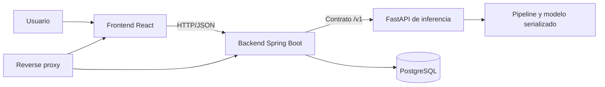

# Arquitectura de integración del MVP — propuesta

> Estado: propuesta para revisión. No constituye todavía una decisión del equipo.

## Objetivo

Entregar una vertical mínima que reciba un texto técnico, lo clasifique mediante un modelo entrenado, extraiga palabras clave, persista el resultado mínimo y lo demuestre desplegado en OCI.

## Ruta crítica

1. El usuario envía `titulo` opcional y `texto` desde una interfaz mínima.
2. Spring Boot valida la solicitud y genera un identificador de trazabilidad.
3. Spring Boot llama al contrato interno versionado de FastAPI.
4. FastAPI comprueba que el modelo esté cargado, ejecuta el pipeline y devuelve la predicción.
5. Spring Boot persiste el contenido y el resultado mínimo.
6. El cliente recibe JSON sin conocer detalles internos del modelo.

## Límites del MVP

### Obligatorio para la primera vertical

- Procesamiento individual de título y texto.
- Clasificación temática.
- Extracción de palabras clave.
- Confianza y versión del modelo en la respuesta.
- Validaciones, errores controlados y healthchecks.
- Persistencia mínima de entrada y resultado.
- Ejecución local reproducible y despliegue demostrable en OCI.

### Condicionado a que la vertical esté estable

- Consulta simple de historial.
- Procesamiento CSV por lotes.

### Fuera de la ruta crítica

- Búsqueda semántica.
- Recomendaciones.
- Clustering en producción y regeneración de grupos.
- Configuración dinámica de TF-IDF.
- Dashboard analítico avanzado.
- Autenticación y gestión de usuarios.

## Componentes y responsabilidades

| Componente | Responsabilidad | No debe asumir |
|---|---|---|
| Frontend | Capturar datos, mostrar carga, resultado y errores amigables. | Consumir FastAPI o PostgreSQL directamente. |
| Spring Boot | API pública, validación de negocio, orquestación, persistencia y traducción de errores. | Reimplementar el pipeline del modelo. |
| FastAPI | Cargar el artefacto, preprocesar, inferir y exponer salud del modelo. | Persistir contenidos o conocer la UI. |
| Data Science | Corpus, notebook reproducible, pipeline, evaluación y artefacto versionado. | Cambiar unilateralmente el contrato HTTP. |
| PostgreSQL | Persistencia mínima gestionada por Backend. | Ser accesible desde Internet o desde Frontend. |
| DevOps | Compose, CI/CD, OCI, observabilidad, secretos y procedimiento de rollback. | Convertirse en integrador manual de ramas por rol. |
| Tech Lead | Resolver decisiones transversales y aprobar contratos. | Aprobar su propio cambio sin revisión cuando sea autor. |

## Contratos

El contrato Spring Boot–FastAPI vive en `contracts/inference-api.yaml`.

Reglas propuestas:

- La URL interna se configura mediante variable de entorno; no se codifica en el código.
- El prefijo `/v1` protege a los consumidores de cambios incompatibles.
- `titulo` permanece separado de `texto` para no perder semántica.
- La categoría se mantiene como `string` hasta aprobar la taxonomía.
- Cada respuesta incluye `version_modelo` para trazabilidad.
- Los errores no exponen trazas, rutas locales ni detalles internos.

## Salud, trazabilidad y fallos

- Todos los servicios deben ofrecer healthcheck.
- FastAPI solo está listo cuando el modelo fue cargado correctamente.
- Spring Boot aplica timeout a FastAPI y convierte indisponibilidad en una respuesta controlada.
- Un `id_solicitud` debe viajar entre servicios y aparecer en logs y errores.
- Los logs no contienen texto completo del usuario, secretos ni credenciales.

## Despliegue mínimo en OCI

- Una instancia OCI Compute ejecuta los contenedores mediante Compose.
- Solo el reverse proxy publica puertos `80/443`.
- Spring Boot, FastAPI y PostgreSQL usan una red interna de contenedores.
- PostgreSQL utiliza un volumen persistente y no publica su puerto a Internet.
- El acceso SSH se restringe por origen; no se abre globalmente de forma permanente.
- Las imágenes y el artefacto del modelo se identifican por versión inmutable.
- Variables sensibles se inyectan durante el despliegue y nunca se almacenan en Git.

## Datos y artefactos

- No se versionan datasets completos, datos procesados ni modelos binarios en Git.
- El repositorio puede contener muestras pequeñas, anonimizadas y compatibles con su licencia.
- Cada dataset y modelo debe tener fuente, licencia, checksum, fecha y versión.
- OCI Object Storage es el destino candidato para artefactos grandes; no es obligatorio para la primera vertical si el modelo cabe de forma segura en la imagen.

## Decisiones requeridas antes de implementar

1. Aprobar o modificar la ruta crítica y los no-objetivos.
2. Aprobar los nombres y límites del contrato interno.
3. Definir la taxonomía y el idioma real del modelo.
4. Confirmar si la persistencia mínima entra en el MVP.
5. Confirmar región, tenancy, arquitectura de CPU y responsable suplente de OCI.
